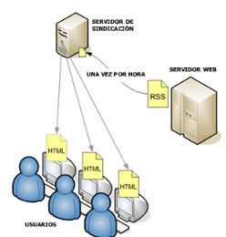
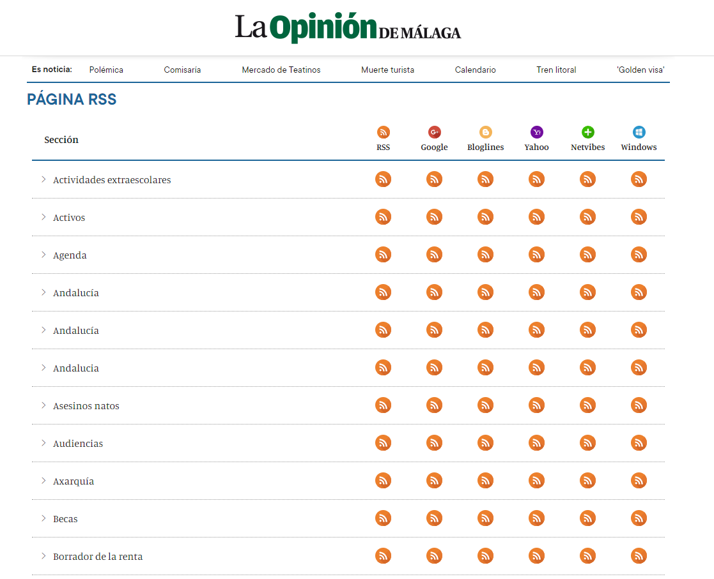
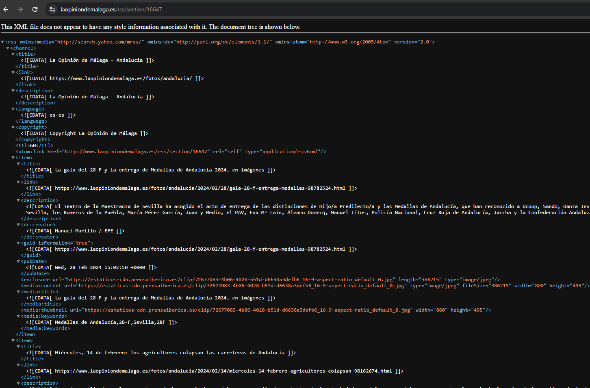

## 1. Sindicación de contenidos

La **sindicación de contenidos** permite a un sitio web utilizar los servicios o contenidos de otra web diferente (cumpliendo las licencias de normas de uso de contenidos o respetando las condiciones del contrato que regula los derechos de ese contenido). 
Los **feed** o **canales de contenidos** están formados por el **contenido** y los **metadatos** que tiene asociados en el sitio original.

La redifusión de contenidos web suele hacerse con licencias de normas de uso. Consiste en ofrecer contenido desde una fuente cuyo origen está en una web para darles a los usuarios actualización del mismo. 
Las fuentes se suelen codificar en XML, aunque pueden codificarse en cualquier lenguaje que se pueda transportar por el protocolo HTTP.

Para leer una fuente o canal hay que suscribirse usando un **agregador**.

Para que una web sea suministradora de un canal en su cabecera `<head>` tiene que incluir un enlace al canal de contenidos.
- Si está hecho con RSS:
`<link rel="alternate" type="application/rss+xml" title="titulo_del_enlace" href="/feed/fichero_rss.xml"`

- Si está hecho con Atom:
`<link rel="alternate" type="application/atom+xml" title="titulo_del_enlace" href="/feed/fichero_atom_xml"`

Además debe indicarse el enlace para acceder al archivo.
- Si está hecho con RSS:
`<a rel="alternate" type="application/rss+xml" title="titulo_del_enlace" href="/feed/fichero_rss.xml">Pulsa aquí</a>`

- Si está hecho con Atom:
 `<a rel="alternate" type="application/atom+xml" title="titulo_del_enlace" href="/feed/fichero_atom.xml">Pulsa aquí</a>`


Publicar en la web puede verse como un flujo de información. Si el origen son unos ficheros en ordenador local, el trabajo es que llegue a los usuarios que leen. Cuando la información se codifica en HTML, se logra actualizando dicho documento en el directorio del servidor web que contiene la página.
Es habitual usar un CMS (sistema de gestión de contenidos). Los contenidos están en un repositorio y, antes de ser servidos al cliente, son transformados (en HTML, en RSS...). Puede haber incluso más de un repositorio. Como están en un CMS las transformaciones pueden replicarse generando tantos ficheros HTML como canales RSS.

##### Tipos de transformaciones:
Documento XML-> Transformación XSLT (Generar documentos a partir de XML https://www.mclibre.org/consultar/xml/lecciones/xml-xslt.html) -> Documento XHTML
Base de datos -> Script en Perl -> Documento HTML
Texto plato -> ASP -> Documento XHTML
Autor -> Bloc de notas -> HTML

##### Ventajas:
- Aumentar el tráfico del sitio web
- Ayudar a que se visite con frecuencia
- Favorecer posicionamiento
- Relaciones entre webs de la comunidad
- Permitir a otras personas añadir características a los servicios del sitio web
- Enriquecer internet impulsando tecnología semántica (trabajo con significado de los datos y no solo ocuparse de los datos) y favoreciendo la reutilización

##### Ámbitos de aplicación

Lo más habitual es el texto, por ser el formato de datos más habitual de los blogs.
Pero también se puede sindicar cualquier tipo de información (redifusión de vídeos - youtube)
Siempre se han sindicado contenidos y compartido todo tipo de información en XML. Se pueden ofrecer contenidos propios para que los muestre otra web aumentando el valor de la página que muestra el contenido y el valor del sitio web original ya que enlaza con él.
Permite desde el punto de vista la actualización profesional "estar al día" en temas relacionados con profesión, recibiendo noticias e informaciones en su blog o en su programa agregador de noticias.



## 3. Tecnologías de creación de canales de contenidos

Hay dos grupos:

**RSS**: (Really Simple Syndication): Parte de la familia de los formatos XML. Desarrollado para compartir la información que se actualiza con frecuencia entre sitios web. Se usa en conexión con sistemas de mensajería instantánea, la conversión de RSS en mensajes de correo o la capacidad de transformar enlaces favoritos del navegador en RSS. Ha sido desarrollado por tres organizaciones, dando lugar a siete formatos diferentes entre sí:

RSS 0.90. Estándar creado por Netscape en 1999. Especificación RDF de metadatos (titulares de otras webs)
RSS 0.91. Netscape. Simplificada de 0.90. Detenido por falta de éxito. Continuado por UserLandSoftware para blogs. (Que luego rechazan 1.0 por considerarlo complejo y siguen 0.92, 0.93, 0.94 con síntaxis incompleta y sin las normas XML)
RSS 1.0. A partir de 0.90. Es el más estable, permite definir cantidad mayor de datos.
RSS 2.0. Para subsanar los problemas de las versiones de UserLandSoftware.

**Atom** :Estándar propuesto por Atom Publishing Format and Protocol de la IETF en RFC4287. Alternativa a RSS para evitar la confusión creada por estándares similares entre los que incluso había incompatibilidad. Convive con ellos. Se caracteriza por su flexibilidad. Permite más control sobre cantidad de información a representar en los agregadores. 

## 4. Estructura de canales de contenidos

Un canal de contenidos se construye creando un fichero siguiendo especificaciones RSS o Atom, basadas en XML.

El fichero tendrá:
- Declaración de documento XML y definición de codificación empleada (UTF-8 preferiblemente)
- Canal en el que se determina el sitio web asociado a la fuente web a la que hace referencia el fichero
- Secciones: Cada una es una referencia a la web que contiene uno de los servicios que se van a ofrecer. Pueden incluirse tantas secciones como se quiera en un canal. No hay restricción respecto a la cantidad de canales de contenido que puede ofrecer un sitio web.
### 4.1. RSS

- Declaración del documento XML y codificación
- Versión RSS (ejemplar del documento)
- Definición del canal con elemento `channel` que debe contener elementos
- Subelementos de `channel`

| Elemento        | Definición                                         |
| --------------- | -------------------------------------------------- |
| `<title>`       | Título que se da al sitio web                      |
| `<link>`        | Dirección web de la página asociada al fichero RSS |
| `<description>` | Breve comentario con finalidad del sitio           |
| `<language>`    | Idioma usado en el sitio                           |
| `<item>`        | Secciones del canal                                |

Los items son links a otros recursos, cada uno con descripción diferente. Los canales son usados en sistemas en los que el contenido puede estar segmentado en partes independientes que pueden estar enlazadas. Cada item debe incluir:

| Elemento        | Definición                                                                   |
| --------------- | ---------------------------------------------------------------------------- |
| `<title>`       | Título del enlace al que se referencia (no tiene que coincidir con el canal) |
| `<link>`        | URL de la página enlazada, que debe pertenecer al dominio del canal          |
| `<description>` | Comentario que define el contenido                                           |

### Ejemplo RSS

```xml
<?xml version="1.0" encoding="utf-8"?>
<rss version="2.0">
<!-- Se define el canal -->
   <channel>
         <title>Canal RSS</title>
         <link>http://www.mipagina.es</link>
         <description>Canal RSS de ejemplo</description>
         <language>es</language>
<!-- Se definen los distintos items del canal-->      
	 <item>
             <title>El tiempo en Almería</title>
             <link>http://www.aemet.es/es/eltiempo/prediccion/municipios/almeria-id04013</link>
             <description>Meteorología en Almería</description>
         </item>
	 <item>
             <title>Noticias de interés</title>
             <link>http://desarrolloweb.com/de_interes/</link>
             <description>Aqui podras encontrar todo tipo de noticias interesantes para los desarrolladores web</description>
        </item>
    </channel>
</rss>
```

### 4.2. Atom

- Declaración del documento XML y codificación
- Definición del canal con elemento `feed` , estándar de atom y lenguaje usado
- Subelementos de `feed`

| Elemento    | Definición                                                                                                                                                                                                                                                                                                                                                                                                    |
| ----------- | ------------------------------------------------------------------------------------------------------------------------------------------------------------------------------------------------------------------------------------------------------------------------------------------------------------------------------------------------------------------------------------------------------------- |
| `<title>`   | Título que se da al sitio web                                                                                                                                                                                                                                                                                                                                                                                 |
| `<id>`      | Identificador del canal (URL)                                                                                                                                                                                                                                                                                                                                                                                 |
| `<link>`    | enlaces que definen el canal. Son necesarios dos: Uno al fichero .atom (cuyo valor de rel será self) y otro al fichero web que oferta ese canal (rel=alternate)                                                                                                                                                                                                                                               |
| `<updated>` | Fecha y hora de actualización con formato CCYY-MM-DDTHH:MM:SSZ  (donde T es el separador entre la fecha y la hora y Z indica que la hora hace referencia al sistema de tiempo universal, esto es la hora zulú, o la hora del meridiano de Greenwich.  <br>Entonces para indicar que el canal se ha actualizado el 6 de febrero de 2010 a la 17:15 hora española tenemos que poner:  <br>2010-02-06T16:15:00Z) |
| `<author>`  | Autor del enlace (otros elementos como name o email)                                                                                                                                                                                                                                                                                                                                                          |
| `<entry>`   | Cada sección del canal                                                                                                                                                                                                                                                                                                                                                                                        |

 Cada entry debe incluir:

| Elemento    | Definición                                                                   |
| ----------- | ---------------------------------------------------------------------------- |
| `<title>`   | Título del enlace al que se referencia (no tiene que coincidir con el canal) |
| `<id>`      | Identificador de la sección, debe ser única en el fichero                    |
| `<link>`    | enlace a fuente de la sección (rel="alternate")                              |
| `<updated>` | Fecha y hora de actualización. Solo se modifica en casos significativos.     |
| `<author>`  | Autor del enlace                                                             |
| `<summary>` | Resumen del contenido del enlace                                             |

### Ejemplo Atom

```xml
<?xml version="1.0" encoding="utf-8"?>
<!--Se crea el canal, se determina el estándar a utilizar y el idioma del documento-->

<feed xmlns="http://www.w3.org/2005/Atom" xml:lang="es-es">
	<title type="text">LMSGI03 Tarea</title>
	<id>http://www.mipagina.es</id>
	<link rel="self" type="application/atom+xml" href="http://www.mipagina.es/feed/canal_atom.atom" />
	<link rel="alternate" type="text/html" href="http://www.mipagina.es"/>
	<updated>2013-11-11T19:20:46Z</updated>
	<author>
             <name>Nombre y Apellidos</name>
             <email>nombre@dominio.com</email>
        </author>

<!--Se definen las secciones que forman el canal-->	
	<entry>
		<title>El tiempo en Almería</title>
		<link rel="alternate" type="text/html" href="http://www.aemet.es/es/eltiempo/prediccion/municipios/almeria-id0401" />
		<updated>2013-11-12T19:19:46Z</updated>
		<id>http://www.aemet.es/es/eltiempo/prediccion/municipios/almeria-id0401</id>
		<author>
			<name>Nombre y Apellidos</name>
        	       <email>nombre@dominio.com</email>
		</author>
		<summary>Consulta el tiempo meteorológico de Almería</summary>
	</entry>
	
	<entry>
		<title>Noticias de interés web</title>
		<link rel="alternate" type="text/html" href="http://desarrolloweb.com/de_interes"/>
		<updated>2013-11-12T19:17:55Z</updated>
		<id>http://desarrolloweb.com/de_interes</id>
		<author>
			<name>Nombre y Apellidos</name>
        	       <email>nombre@dominio.com</email>
		</author>
		<summary>Aqui podras encontrar todo tipo de noticias interesantes para los desarrolladores web</summary>
	</entry>
</feed>
```


----

Miro en un periódico y veo en su código fuente:

```html
        <link rel="alternate" title="Últimas Noticias | La Opinión de Málaga" href="/rss/" type="application/rss+xml" />
```





## 5. Validación

Cuando se crea un fichero fuente,  hay que validarlo con algún validador.

Se da la dirección del fichero alojado y comprueban que lo pueden encontrar (que la URL es válida y no contiene errores). 
Una vez validado, ofrecen una imagen del tipo XML o RSS de color naranja por lo general que se puede incluir en la dirección principal para enlazar a la dirección del fichero alojado en su dominio. Cuando un visitante pulse sobre este icono, accederá al contenido actual de la fuente y podrá navegar a las páginas que más le interesen. 
Algunos servicios de validación también ofrecen imágenes que se pueden incluir en la página para que se compruebe que el canal es válido.

(W3C Feed Validation Services por URI o código, RSS Advisory Board)

## 6. Utilización de herramientas

Hay herramientas para crear y editar fuentes web con interfaces que simplifican al máximo el trabajo con canales de contenidos como PSPad editor con el que se puede:
- Trabajar con distintos estándares
- Importar CSV y HTML
- Editar HTML
- Editar XML e imágenes
- Actualizar fuentes vía FPT
- Exportar documentos RSS a HTML, CSV y Javascript

"Trabajar con algún editor de fuentes web permite, entre otras cosas, generar fuentes con cualquier tecnología de sindicación"
## 7. Directorios de canales de contenidos

El fichero generado y validado debe registrarse en un directorio de canal de contenidos.

Estos permiten que el fichero RSS esté disponible para cualquiera, facilita a usuarios la búsqueda de información ya que clasifican los ficheros RSS.
Para ello se registra el fichero RSS en el directorio RSS, como cuando se registra un sitio en un motor de búsqueda. 

Buscazoom RSS es un directorio de noticias y canales RSS. "Si tienes una web añade el feed RSS al directorio, aumenta tus visitas y ayúdanos a construir el mayor directorio de internetx es gratuito".

Recomendable codificación UTF-8 y uso de entidades XML que sustituyen a letras con tildes o ñ.
`&aacute;` en lugar de `á`;  `&lt` en lugar de `<` ; `&gt` en lugar de `>`,...

También puede proporcionarse el canal en Yahoo, Google...

## 8. Agregación

Se llama **agregador o lector de fuentes** a una aplicación de software para suscribirse a fuentes en formatos RSS y Atom. Agregador avisa a usuario de qué webs han incorporado contenido nuevo desde la última lectura y cuál es ese contenido.

Tipos de agregadores:
- **Herramientas de suscripción a canales vía RSS vía web o agregadores en línea**: Residen en algunos sitios web y se ejecutan a través de la web. Uno se tiene que dar de alta y dar de alta un perfil. Recomendable cuando no se accede a internet siempre desde el mismo ordenador (Netvibes, feedly, inoreader)
- **Herramientas de suscripción navegador web**: En el navegador web o programa de correo electrónico. Antes predeterminadas; ahora como plugin. (Softzone)
- **Herramientas de suscripción con programas de escritorio:** En el ordenador del usuario. Útil cuando se accede desde el mismo. Interfaz gráfica parecida a programa de correo electrónico. (Feedreader, RSSReader) 
- **Herramientas de suscripción Podcast o podcasting**: El podcast es distribución de archivos multimedia mediante redifusión como RSS (tiene posibilidad de suscribirse y usar programas de descarga para que los usuarios lo escuchen y vean). Podcast de audio (archivos mp3, AAC). Podcast de vídeo (vodcast o videocast): Requieren "conexiones de gran ancho de banda (mp4, m4v). Pueden subirse y alojarse en... .....  Da igual. Esto tiene mil años. 

## 9. Servidores

-  Ordenador o máquina "al servicio" de otras. Suministra a los clientes todo tipo de información... Se da lo que se conoce como "Esquema cliente-servidor".
- Suelen ser algo más potentes que un ordenador normal
- Tipos: Correo, proxy, web, BBDD, clusters, dedicados...

* Los servidores web almacenan documentos HTML, imágenes, vídeos, textos,... Para crear una web debe contarse con un dominioy unservidor donde alojar los archivos. Recomendable al principio usare servidor local o de pruebas para no perder tiempo con el de pago mientras lo hacemos y para no tener un mal SEO (páginas 404 que vamos cambiando).
* El servidor local es un ordenador con aplicaciones instaladas para servidor de prueba

Para que el ordenador funcione como servidor online necesitaríamos:
- Sistema operativo (windows, MAC, linux)
- Apache. Aplicación madre que permite que sea un servidor
- MySQL. BBDD controlada por apache
- PHP. Tecnología de programación

De código abierto. Las puedo instalar por separado pero hay paquetes que las engloban todas como LAMP (Linux, Apache, MySQL, PHP);  que en MAC es MAMP y en Windows WAMP. También hay XAMPP.